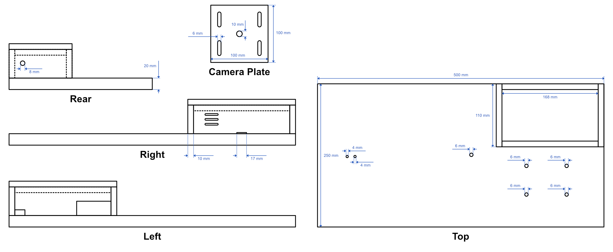

# 8mm Film Scanner

The *8mm Film Scanner* is a project to build a scanner for digitising motion picture film in both the *Regular 8* and *Super 8* gauges by converting an old projector with the help of a [Raspberry Pi](https://www.raspberrypi.org) single board computer.

In this repository, I have collected all my materials on this project, including source code, information on the hardware and software design, instructions for using the software, a rundown of my scanning and editing workflow, and many more.


### Table of contents
- [Introduction](#introduction)
- [Detailed technical description](#detailed-technical-description)
    - [Hardware design](#hardware-design)
        - [Projector conversion](#projector-conversion)
        - [Camera](#camera)
        - [Electrical systems and wiring](#electrical-systems-and-wiring)
        - [Base plate and case](#base-plate-and-case)
    - [Software design](#software-design)
        - [Scanning operations](#scanning-operations)
        - [Dashboard and other user experience](#dashboard-and-other-user-experience)
    - [Scanning workflow](#scanning-workflow)
    - [Cost](#cost)
    - [Future features and fixes](#future-features-and-fixes)
- [Run the software on your own scanner](#run-the-software-on-your-own-scanner)
    - [Installation](#installation)
    - [How to use](#how-to-use)
- [Contributing](#contributing)
- [Acknowledgements](#acknowledgements)


## Introduction

I while ago, I found myself with over 800 rolls of 8mm film my grandfather had filmed throughout the 1960s, 70s and 80s. Having just digitised my grandparents' photo collection, naturally I wanted to know what was on these 8mm films and digitise them as well, so they would be safe from further deterioration and so we would actually watch them instead of always being too lazy to set up the projector.

Now, the easiest way to get films like these digitised is the use of a digitisation service. But for the sheer amount of film I had, this would have cost me well over 10,000€ and with these services you never know whether you will actually get a decent quality scan. The next option was to just get out the old projector and use a video camera to record the films as they play. This is a perfectly valid option and super easy to do, but the resulting recordings usually suffer from distortion, bad colours, a lack of sharpness and quite a bit of flicker. To do the true quality of these films justice, what was really needed was a frame-by-frame scanner. You can actually buy these but the ones available are either so expensive that they only make sense for professional users (e.g. scanners by [Filmfabriek](https://filmfabriek.nl)) or they leave a lot to be desired in terms of quality (like the famed [Wolverine](https://www.wolverinedata.com/products/MovieMaker_Pro)).

The solution is to build your own scanner, an idea that got hooked on after finding a [video on the AACA Library's *Mike's Movie Machine*](https://www.youtube.com/watch?v=luGacxJMZI8), which is really just an incarnation of the absolutely amazing [*Kinograph*](https://www.kinograph.cc) project. TODO [Kinograph Forums](https://forums.kinograph.cc)

In the following, you will find a detailed description of my *8mm Film Scanner* and the workflow around it. The scanner is built around an old dual-gauge film projector and a [Raspberry Pi](https://www.raspberrypi.org) single board computer.

TODO more on features and capabilities, less on story and why not to do service or other scanning methods

Below you find a photo of my scanner, a screenshot of its web interface as well as a sample scan.

TODO Insert photo, screenshot and sample scan.

TODO Replace with nicer photo


TODO Just an example video
<iframe width="560" height="315" src="https://www.youtube.com/embed/dQVIjNfx9Is" title="YouTube video player" frameborder="0" allow="accelerometer; autoplay; clipboard-write; encrypted-media; gyroscope; picture-in-picture" allowfullscreen></iframe>


The rest of this README is intended as a documentation of every detail and lesson learned about my scanner. The goal here is to provide all the information and source code necessary to build another one.


## Detailed technical description

This section will go over every technical detail of the *8mm Film Scanner*. The goal is to document everything necessary to rebuild the scanner some day far in the future without having to redo all the research I did.


### Hardware design

Lorem ipsum ...


#### Projector conversion

The scanner is built around a *Bolex 18-3 TC* dual gauge film projector. There is no is no particular reason why I used this projector other than that I was able to get it cheaply because it was sold as defective. I never tested the electrics of the projector but the film transport mechanism turned out to be in perfectly find condition, which is all I cared about for this project.

There do exist some almost identical models to this one by Bolex and Eumig, inclduing the Bolex 18-3 Duo, Eumig 610 D, Eumig 605 D, Eumig 614 D and Revue Lux 3003.

In order to convert the projector, I removed the power supply and the motor/fan assembly. In its place, I mounted an acrylic plate

also remove lens

mount stepper motor, motor driver hall effect sensor and magnet on aperture wheel


Replace lamp with MR16 LED and place plexiglas sheet in front of it for diffusion


#### Camera

The scanner uses the *Raspberry Pi HQ Camera* for taking pictures of the frames on the film. The HQ Camera is well suited for this task because its sensor delivers more than adequate quality and its C-mount makes it possible to mount a wide variety of lenses.

The lens used is a Schneider-Kreuznach Componon-S 50mm enlarger lens. Enlarger lenses like it are widely available on the used market and well-suited to macro imaging applications. Enlarger lenses also have the nice property of a very flat image plane - exactly what is needed in a film scanning application. The Componon-S in particular is a very nice model and quite popular in the film scanning community, but other similar enlarger lenses are likely just as well suited.

The Componon-S has an M39 thread and needs to adapted to the camera's C-mount. It also requires some distance to the sensor to achieve the enlargement required to make a Regular 8 or Super 8 frame fill the camera's sensor. As finding adapters directly from C-mount to M39 turned out to be rather difficult, I chose to adapt via M42. This has the nice side-effect that the M42 thread was widely used by Pentax in the 1960s and 70s, making adapters to other mounts as well as macro extension tubes very easy to get. In the photo below you can see the camera assembly. Starting from the camera, the following components are used to mount the lens:

 - C-mount to M42 adapter
 - 19mm M42 extension tube
 - 26mm M42 extension tube
 - M42 to M39 adapter ring (screws into the inside of the M42 thread and is therefore not visible)


The resulting extension is just about right to fit the larger Super 8 frame with enough play to all sides. The lens also delivers very sharp images and does not show any visible vignetting. It must be noted, however, that APERTURE SHARPNESS FALLOFF

macro slider for fine focus adjustment


#### Electrical systems and wiring

Below you can see an overview of the scanner's electrical systems with red and black connections representing positive and negative power connections, and all other colours representing signal connections.


The scanner is powered by a fairly standard 45W [USB-C power supply](https://www.amazon.de/gp/product/B098P15D4N/ref=ppx_yo_dt_b_search_asin_title?ie=UTF8&psc=1). The power supply is connected via a USB-C cable with USB-C PD support to a ZY12PDN USB-C PD trigger board. This board is capable of negotiating with the power supply that it should deliver power as well as the USB-C PD mode that is used. Different modes differ primarily in the voltage delivered. The trigger board can be configured via a button on the board to negotiate a particular voltage. In our particular case, the trigger board is configured to negotiate the 15V mode, though 20V would work just as well. Note that the power supply must support the mode. If the power supply does not support the mode the trigger board asks for, USB-C PD will fall back to 5V. At this voltage the scanner will not work, but 5V will not damage it either.

A pair of LM2596S step down modules are then used to step the 15V from the power supply down to 5V required by the Raspberry Pi and 12V for the stepper motor and the LED light. While it would be possible to connect the Pi to the step down converter directly using jumper wires on its GPIO pins, the Micro USB end of an old USB cable is used instead. This keeps the Pi's fuses in circuit and protects the Pi in case of a problem with the power supply.

The stepper motor is driven by an A4988 stepper driver that sits on a [very practical PCB](https://www.amazon.de/gp/product/B07RGJQFSX/ref=ppx_yo_dt_b_search_asin_title?ie=UTF8&psc=1) that makes it easier to mount and connect the driver. The Pi controls the stepper motor direction via its GPIO 21 pin (white), enables the stepper via its GPIO 16 pin (orange) and steps the motor via its GPIO 20 pin (green). Using the switches on the PCB, the driver is configured to run the stepper motor in full-step mode. Note that this PCB also has additional positive and ground supply pins which are used to make the Pi's 3.3V available in the projector housing due the the location of the Pi in the wooden case.

The LED light is controlled by the Pi using a KF-301 relay module that can switch the 12V supply to the light. The relay receives its logic power from the 3.3V supply of the Pi and is controlled via the Pi's GPIO 6 pin (blue). Note that it is important that the relay is connected to the 3.3V supply and **NOT** the 5V supply, the the logic level is 3.3V and it will not trigger properly otherwise. The relay is connected to the LED light through through the original bulb's GU5.3 socket.

The hall effect sensor, too, is connected to the Pi's 3.3V rail through the stepper PCB. It's digital signal output is connected to the PI via the GPIO 26 pin (purple). Note that a potentiometer on the hall effect sensor module allows for setting the threshold of the digital trigger. This setting will likely need adjusting to make the scanner work properly.

The Pi also supplies a small case fan from its 3.3V supply.

Computations on energy usage


#### Base plate and case




Include constructionszeichnungen mit Maßen

Wooden frame and case from plywood to protect electronics and make easy to stow

wooden case with lid. cooling fan on "grill" keeps Pi cooler than it would be outside

PCBs mounted with double sided tape

Projector mounted using mounting holes for original feet, used paper to trace over, M6 screws, spacers to deal with tilt

Camera mounted on macro slider, on wooden plate for rough adjustments left and right and up and down

Case is painted in edding clear coat


### Software design

Two parts

server handling scanning and web interface


#### Scanning operations

something about the scanning, advancing, stepper motor driving and hall detection


#### Dashboard and other user experience

web interface for easy use, describe video streaming and message structures


### Scanning workflow

Note that this is not the only way to do it and in particular the particular softwares I use can be replaced with others easily

Scan to RAW, to SSD (because SSD faster than internal)

Convert raw bayer data to .dng files with script and RPiDNG

Adjust colour and crop, then export to tiff

From tiff files render into master video file (I use Apple Compressor to ProRes)

Import into Final cut, crop to 4:3 and use Neat Video to remove what I feel like might be digital noise but preserve film grain

Then use Neat and if required manual work to remove dust "that I find distracting".

Chose not to completely degrain or stabilise to keep analog feel and not outstabilise original handshake


### Cost

Put a table here of cost of everything


### Future features and fixes

Dashboard camera settings, mounting PCBs in case


## Run the software on your own scanner

Feel free to use this software on your own scanner

brief instrictions

prerequestie is that electrical connections are the same

advance routine might need adjusting as timed to this scanner


### Installation

Not tested because I have only one piece of hardware

Ensure same connections as those described above as well as Raspberry Pi with Raspberry Pi OS installed as normal

Clone repository (`Desktop`).

```sh
git clone https://github.com/jank324/8mm-film-scanner.git
```

Install python packages

```sh
sudo python3 -m pip install -r requirements.txt
```

Need *npm* installed.

`cd` to `frontend` directory.

```sh
cd frontend
```

install packages

```sh
npm install
```

then build frontend via

```sh
npm run build
```

`cd` back to the project root (`..`) then you can start the server by running

```sh
sudo python3 server.py
```

You probably want to run the server on boot of the Pi ...

This repository provides a *systemd* service `8mmfilmscanner.service` that runs the 8mm Film Scanner's server on boot. To set up the service, copy the `.service` file to `/etc/systemd/system` by running

```bash
sudo cp 8mmfilmscanner.service /etc/systemd/system/
```

and then enable it via

```bash
systemctl enable 8mmfilmscanner
```

then to send email notifications on finished scans

create mail account of your choice

create file `notification_config.yaml` in project root directory

Fill in the following with the details of your mail account and the mail address you want e-mails to be sent to

```yaml
user: scanners@mail.com         # Address of the scanner's account
password: scannerspassword123   # Password of the scanner's account
to: your@mail.com               # Address notifications are sent to (presumably your own)
```

Please remember to **NEVER** commit `notification_config.yaml` as it contains the password to the scanner's mail account which should remain secret. Under normal circumstances, this repository's `.gitignore` should already take care of this.

### How to use

Type in path, click here to start scan or turn on light etc. ...


# Contributing

basically say please feel free to use and contribute by issues and pull requests


# Acknowledgements

Kinograph forum (and Matthew Aepler)
