# 8mm Film Scanner

The *8mm Film Scanner* is a project to build a scanner for digitising 8mm motion picture film in both the *Regular 8* and *Super 8* gauges by converting an old projector with the help of a [Raspberry Pi](https://www.raspberrypi.org) single board computer.

In this repository, I have collected all my materials on this project, including source code, information on the hardware and software design, instructions for using the software, a rundown of my scanning and editing workflow and many more.


### Table of contents
- [Introduction](#introduction)
- [Detailed technical description](#detailed-technical-description)
    - [Hardware design](#hardware-design)
        - [Projector conversion](#projector-conversion)
        - [Camera](#camera)
        - [Electrical systems and wiring](#electrical-systems-and-wiring)
        - [Base plate and case](#base-plate-and-case)
    - [Software design](#software-design)
        - [Scanning operations](#scanning-operations)
        - [Dashboard and other user experience](#dashboard-and-other-user-experience)
    - [Scanning workflow](#scanning-workflow)
    - [Cost](#cost)
    - [Future features and fixes](#future-features-and-fixes)
- [Run the software on your own scanner](#run-the-software-on-your-own-scanner)
    - [Installation](#installation)
    - [How to use](#how-to-use)
- [Contributing](#contributing)
- [Acknowledgements](#acknowledgements)

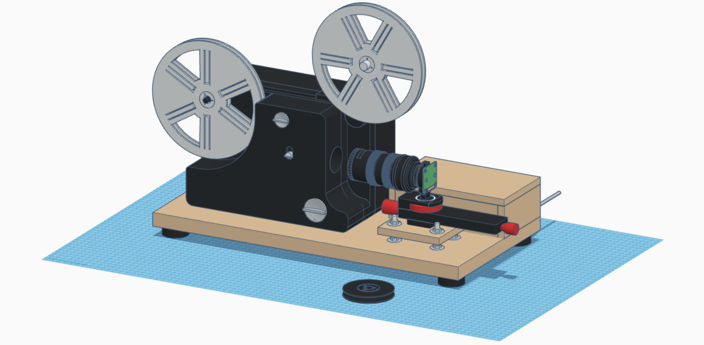


## Introduction

I while ago, I found myself with over 800 rolls of 8mm film my grandfather had filmed throughout the 1960s, 70s and 80s. Having just digitised my grandparents' photo collection, naturally I wanted to know what was on these 8mm films and digitise them as well, so they would be safe from further deterioration and so we would actually watch them instead of always being too lazy to set up the projector.

The easiest way to get films like these digitised is the use of a digitisation service. But for the sheer amount of film I had, this would have cost me well over 10,000€ and with these services you never know whether you will actually receive a decent quality scan. The next option was to get out the old projector and use a video camera to record the films as they play. This is a perfectly valid option and super easy to do, but the resulting recordings usually suffer from image distortion, bad colours, a lack of sharpness and quite a bit of flicker. To do the true quality of these films justice, what was really needed was a frame-by-frame scanner that takes an image of every single frame of the film directly off of the film itself. You can actually buy these, but the ones available are either so expensive that they only make sense for professional users (e.g. scanners by [Filmfabriek](https://filmfabriek.nl)) or they leave a lot to be desired in terms of quality (like the famed [Wolverine](https://www.wolverinedata.com/products/MovieMaker_Pro)).

The solution is to build your own scanner, an idea that I got hooked on after finding a [video on the AACA Library's *Mike's Movie Machine*](https://www.youtube.com/watch?v=luGacxJMZI8), which is really just an incarnation of the absolutely amazing [*Kinograph*](https://www.kinograph.cc) project. The Kinograph project is accompanied by the [Kinograph forums](https://forums.kinograph.cc), quite possibly the best community on motion picture film scanning you will find on the internet, hosting invaluable information and some incredible projects built by talented and passionate people. On scanner build project in particular that I would like to point out as they key inspiration for this project is [the build by Scott Schiller](https://youtube.com/playlist?list=PLIACRGgedheWF4xr1zxiASZ1QqJUfloQ2), who also produced an awesome video series about his scanner and his scanning workflow.

In the following, you will find a detailed description of my *8mm Film Scanner* as well as my scanning workflow, using a dual-gauge film projector and a [Raspberry Pi](https://www.raspberrypi.org) with a *HQ Camera*.

Some of the features of this scanner include:
 - Dual gauge scanning of both *Regular 8* and *Super 8*
 - Up to 3K resolution (though 2K is recommended, 4K is possible with modifications)
 - Scanning independent from a computer, allowing for unattended scans
 - RAW scanning workflow
 - Support for up two 120 m (400 feet) reels
 - An easy-to-use web interface (with a mobile version as well as light and dark modes)
 - Once-piece design that takes no time to set up or stow away

Below you find ...

 - ... a photo of the scanner
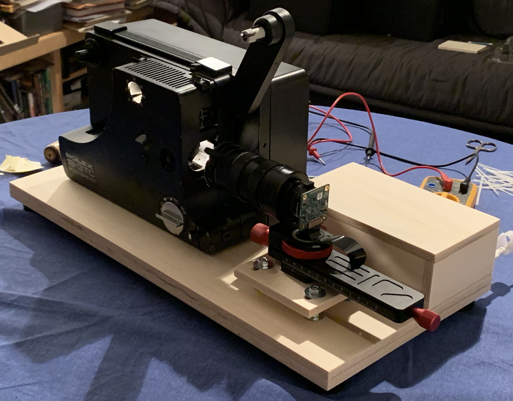

 - ... a screenshot of the scanner's web interface


 - ... a video of samples scans
TODO Sample scan.

TODO Just an example video
<iframe width="560" height="315" src="https://www.youtube.com/embed/dQVIjNfx9Is" title="YouTube video player" frameborder="0" allow="accelerometer; autoplay; clipboard-write; encrypted-media; gyroscope; picture-in-picture" allowfullscreen></iframe>

The rest of this README is intended as a documentation of every detail and lesson learned about my scanner. The goal here is to provide all the information and source code required to build another one.


## Detailed technical description

This section will go over technical details of the *8mm Film Scanner*. The goal is to document provide other (or even myself at some point in the future) with everything needed to rebuild the scanner without having to redo all the research I did.


### Hardware design

In this section, the hardware of the scanner is described. It will go over how the projector was converted to be a scanner, the camera sensor, lenses and mount, the electronics supplying power to and communication between the components as well as the base plate holding everything together.


#### Projector conversion

The scanner is built around a *Bolex 18-3 TC* dual gauge film projector. There was no particular reason why I used this projector other than that I found a very cheap one sold as defective in the local ads. I never tested the electric components of the projector, but the film transport was in perfectly fine condition, which is all I cared about for this project.

There are some almost identical models to this one by Bolex and Eumig, including the Bolex 18-3 Duo, Eumig 610 D, Eumig 605 D, Eumig 614 D and Revue Lux 3003. So, if you would like to follow along with this build, the conversion should be almost the same for these models. Other projectors, however, will also be just fine and look fairly similar.

In order to convert the projector, I removed the power supply and the motor/fan assembly from the left side of the housing. In its place, I mounted an acrylic base plate to mount new components to. A photo of the baseplate with its components is shown below. For this particular projector, a tensioning arm for the main drive chain was originally mounted to the motor/fan assembly. This was simply remounted on the base plate. Furthermore, a [Nema 17 1.5 A 12 V stepper motor](https://www.amazon.de/gp/product/B07KZQ77VH/ref=ppx_yo_dt_b_search_asin_title?ie=UTF8&psc=1) was mounted using a right angle [mounting bracket](https://www.amazon.de/gp/product/B07CM3LZD1/ref=ppx_yo_dt_b_search_asin_title?ie=UTF8&psc=1) designed for NEMA 17 stepper motors. A pulley is mounted to the shaft of the stepper motor. This pulley should match the belt shape and size of the projector, but it is possible to get away with mixing v-belts and a pulley for round belts (see below TODO). I've chosen [this pulley](https://www.amazon.de/gp/product/B07C4R3PGV/ref=ppx_yo_dt_b_asin_title_o05_s00?ie=UTF8&psc=1). Pulley needs to be aligned with the pulley on the projector's main drive shaft (in my case also the aperture wheel). The stepper motor needs to be mounted at the same distance to the drive shaft pulley, such that it maintains the same tension on the drive belt as the original motor did. It might also make sense to replace the belt with a new one. These are readily available online by searching for the projector's name. In addition to the stepper motor assembly, a [KY-024 Hall effect sensor](https://www.amazon.de/gp/product/B089QK1CHR/ref=ppx_yo_dt_b_search_asin_title?ie=UTF8&psc=1) is mounted on the rear of the baseplate using a right-angle bracket. A small [5x1 mm Neodymium magnet](https://www.amazon.de/gp/product/B07T13H3R5/ref=ppx_yo_dt_b_search_asin_title?ie=UTF8&psc=1) is mounted to the core of the aperture wheel. The hall effect sensor and the magnet need to be lined up. They are used to detect that the scanner has advanced one frame. Parts of the electronics are also mounted to the base plate, either using double sided tape or screws as appropriate. They are further described in section TODO.

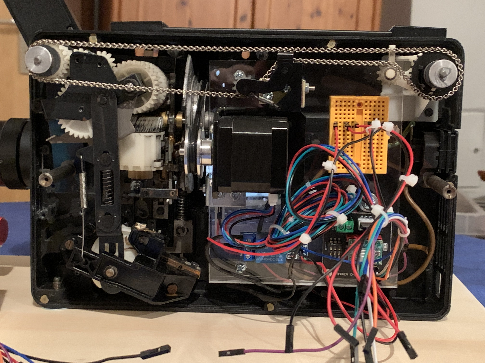

On the right side of the project, the original lens is remove. This allows the camera to take take photos of the film directly from the film gate. Furthermore, I removed a mask from the film gate in order to be able to capture a larger area of the original film frame. I did not drill out the film gate because I did not want to risk scratching the film, but this is certainly an option, if removing the mask does not reveal all of the frame. Neither removing the mask nor drilling out the gate is strictly required, but merely allows the scanner to capture more of the frame the would have been projected.

The original halogen bulb of the projector is replaced with an LED light bulb. Doing so is critical because the film and likely some of the components of the projector would overheat otherwise. Replacing the bulb with an LED very easy on this and many other models of projector, as MR16 LED bulbs can be mounted without any modifications. The bulb should be at least CRI 90+ and produce about 270 lm at an angle of 38°. I chose [this 3W bulb by *greenandco*](https://www.amazon.de/gp/product/B07F14F3N7/ref=ppx_yo_dt_b_search_asin_title?ie=UTF8&psc=1). Note that very similar 6.5 W *Philips Master expertcolor* LED with with 420 lm turned out to be too bright in my earlier experiments. The colour temperature of the bulb should ideally be similar to the original halogen bulb, i.e. somewhere around 2700 K. In addition to mounting an LED bulb, the light of this bulb also needs to be further diffused. I used a 3mm sheet of white acrylic, specifically [*PLEXIGLAS LED white WH52 GT*](https://www.plexiglas.de/en/products/plexiglas/plexiglas-led). This specific type of acrylic by PLEXIGLAS is specifically designed to be colour-accurate for lighting applications and PLEXIGLAS themselves sell small samples for very little money. These samples are more than large enough (in fact I had to cut mine in half) for mounting in front of the MR16 bulb. Note the *WH52* indicating the level of diffusion (and light attenutation) that work well with the LED bulb I chose. The acrylic is mounted to the front of the bulb mounting bracket using double sided tape as can be seen in the photo below.

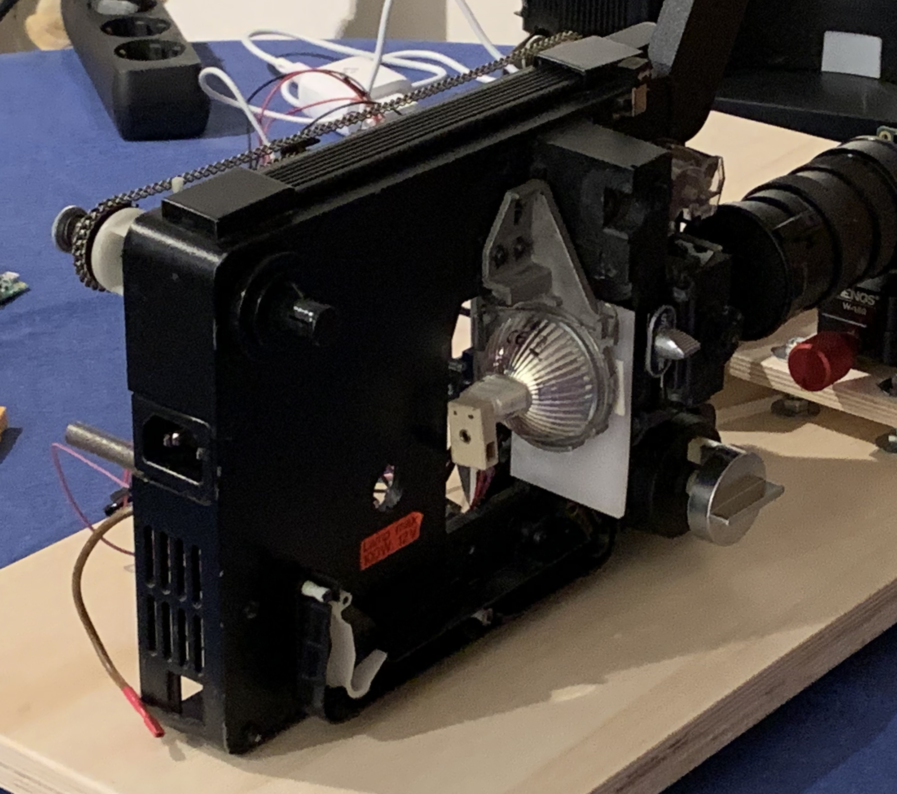


#### Camera

The scanner uses the [*Raspberry Pi HQ Camera*](https://www.raspberrypi.com/products/raspberry-pi-high-quality-camera/) to capture the frames on the film. This model was chosen because it is easy to use with the Raspberry Pi, the image quality is more than adequate and the C-mount as well as its sensor size make it easy to adapt lenses and achieve the magnification required to have the small film frames fill the camera's image sensor.

The lens used is a *Schneider-Kreuznach Componon-S 50mm* enlarger lens. Today, enlarger lenses are widely available on the used market. They well-suited to macro imaging applications and usually have a very flat image plane, helping us avoid focus vignetting. The Componon-S in particular is a very good quality model and a popular choice in the film scanning community, but other similar enlarger lenses are just as well suited.

The Componon-S has an M39 thread and therefore needs to be adapted to the camera's C-mount. It also needs to be mounted at some distance from the image sensor to achieve the enlargement required to make a Regular 8 or Super 8 frame fill the camera's sensor. As finding adapters directly from C-mount to M39 turned out to be rather difficult, I chose to adapt via M42-mount. This mount was widely used by Pentax in the 1960s and 70s, making adapters to other mounts as well as macro extension tubes very easy to find. The following components are used to adapt the enlarger lens to the HQ Camera (starting from the camera):

 - C-mount to M42 adapter
 - 19 mm M42 extension tube
 - 26 mm M42 extension tube
 - M42 to M39 adapter ring (screws into the inside of the M42 thread and is therefore not visible)

The picture below shows the final camera assembly. Note that the M42-to-M39 adapter is not visible as it screws into the inside of the extension tube's thread before the lens is screwed in.

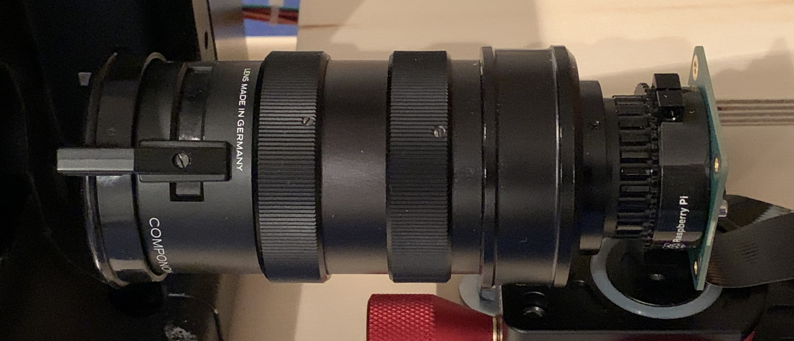

Using the HQ Camera's tripod mount, the camera is mounted on a *MENGS W-160* macro slider that can be used to adjust focus. The same macro slider can often be found under different brands. The macro slider itself is mounted to a wooden baseplate with a [3/8-16x1 screw with a hex head](https://www.amazon.de/gp/product/B07JGWWSFK/ref=ppx_yo_dt_b_search_asin_title?ie=UTF8&psc=1) that was shortened. Four  M6x50mm screws with hex heads are used to mount the base plate to the main plate of the scanner. Using four pairs of nuts and washers, it is possible to adjust the height of the camera. The four wholes to mount the base plate are elongated in parallel to the film plane, allowing for horizontal adjustment of the camera position. More details and measurements of this camera mount can be found in TODO.

The lens is always used at an aperture of f4.7. This was found to be the aperture at which the lens is by far the sharpest and lets in the correct amount of light for the rest of the camera setup.

The forward end of the lens is somewhere around 78 mm away from the film gate, but this has likely changed since as a result of focusing adjustments.

I have published [further studies on the camera setup on the Kinograph forums](https://forums.kinograph.cc/t/reverse-mounting-schneider-componon-s-50-mm-on-c-cs-mount/1767/8?u=jankaiser).


#### Electrical systems and wiring

Below you can see an overview of the scanner's electrical systems with red and black connections representing positive and negative power connections, and all other colours representing signal connections.

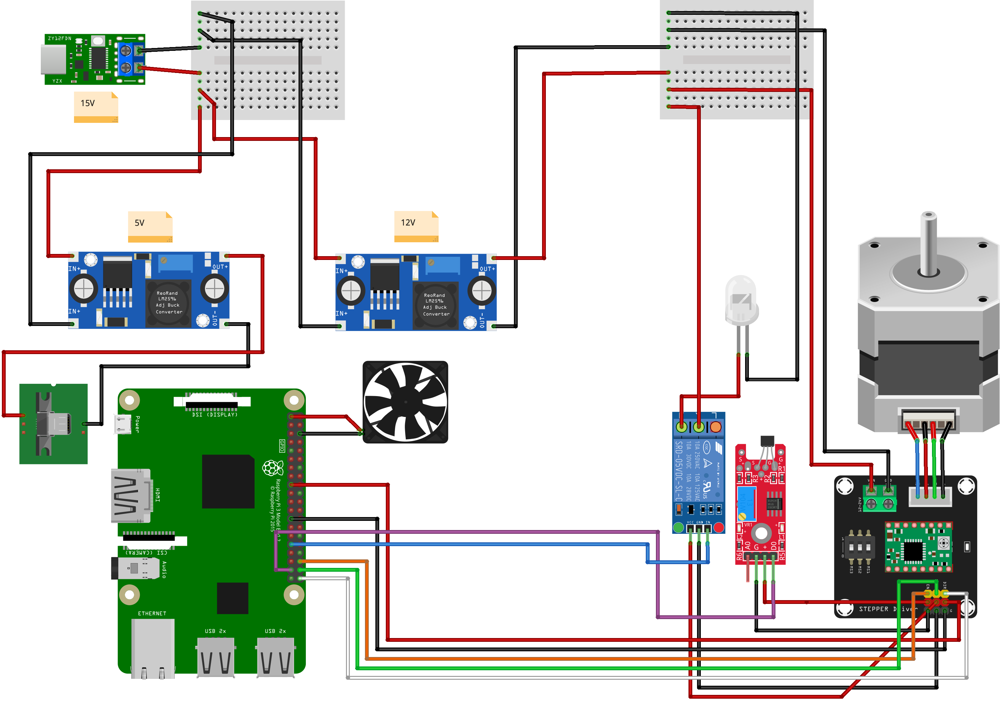

The scanner is powered by a fairly standard [45W USB-C power supply](https://www.amazon.de/gp/product/B098P15D4N/ref=ppx_yo_dt_b_search_asin_title?ie=UTF8&psc=1). The power supply is connected via a USB-C cable with USB-C PD support to a [ZY12PDN USB-C PD trigger board](https://www.amazon.de/gp/product/B08FD6381L/ref=ppx_yo_dt_b_search_asin_title?ie=UTF8&psc=1). This board is capable of negotiating with the power supply that it should deliver power as well as the USB-C PD mode that is used. Different modes differ primarily in the delivered voltage. The trigger board can be configured via a button on the board to negotiate a particular voltage. In this particular case, the trigger board is configured to negotiate the 15V mode, though 20V would work just as well. Note that the power supply must support the mode. If the power supply does not support the mode the trigger board asks for, USB-C PD will fall back to 5V. At this voltage the scanner will not work, but 5V will not damage it either.

A pair of [LM2596S step down modules](https://www.amazon.de/gp/product/B07YWLCTLK/ref=ppx_yo_dt_b_search_asin_title?ie=UTF8&psc=1) are then used to step the 15V from the power supply down to 5V required by the Raspberry Pi and 12V for the stepper motor and the LED light. While it would be possible to connect the Pi to the step down converter directly using jumper wires on its GPIO pins, the Micro USB end of an old USB cable is used instead. This keeps the Pi's fuses in circuit and protects the Pi in case of a problem with the power supply.

The stepper motor is driven by an [A4988 stepper driver](https://www.amazon.de/gp/product/B07C2V9GWC/ref=ppx_yo_dt_b_search_asin_title?ie=UTF8&psc=1) that sits on a [very practical PCB](https://www.amazon.de/gp/product/B07RGJQFSX/ref=ppx_yo_dt_b_search_asin_title?ie=UTF8&psc=1) which makes it easier to mount and connect the driver. The Pi controls the stepper motor direction via its GPIO 21 pin (white), enables the stepper via its GPIO 16 pin (orange) and steps the motor via its GPIO 20 pin (green). Using the switches on the PCB, the driver is configured to run the stepper motor in full-step mode. Note that this PCB also has additional positive and ground supply pins which are used to make the Pi's 3.3V available in the projector housing due the the location of the Pi in the wooden case.

The LED light is controlled by the Pi using a KF-301 relay module that can switch the 12V supply to the light. The relay receives its logic power from the 3.3V supply of the Pi and is controlled via the Pi's GPIO 6 pin (blue). It is important that the relay is connected to the 3.3V supply and **NOT** the 5V supply, the the logic level is 3.3V and it will not trigger properly otherwise. The relay is connected to the LED light through through the original bulb's GU5.3 socket.

The hall effect sensor, too, is connected to the Pi's 3.3V rail through the stepper PCB. It's digital signal output is connected to the PI via the GPIO 26 pin (purple). A potentiometer on the hall effect sensor module allows for setting the threshold of the digital trigger. This setting will likely need adjusting to make the scanner work properly.

The Pi also supplies a small case fan from its 3.3V supply. The fan has proven critical in cooling the Pi inside its cases. A heatsink is also mounted on the Pi's SOC. All cooling components were purchased as part of a typical [Raspberry Pi cooling kit](https://www.amazon.de/gp/product/B07C2V9GWC/ref=ppx_yo_dt_b_search_asin_title?ie=UTF8&psc=1).

Two [mini breadboards](https://www.amazon.de/gp/product/B01M9CHKO4/ref=ppx_yo_dt_b_search_asin_title?ie=UTF8&psc=1) are used to help manage the wiring both inside the projector and the case containing the rest of the electronics.


#### Base plate and case

To make setting up the scanner and stowing it away as easy as possible, the entire system is mounted on a base plate. The base plate also provides housing for the electronics that did not fit into the projector's housing.

The entire base plate is built from 9 mm poplar plywood. For the main part of the base plate, two 9 mm sheets were glued together, giving the base a strength of 18 mm. The housing for the electronics is placed in the front left corner of the base plate. It is fully glued together. There are openings for the Raspberry Pi's ports and the power connector on its left side. A round hole on its rear side allows for wires to be passed through toward the projector housing. On the case's left side, three slits allow for cooling and a narrow slit is placed on the bottom for the camera's ribbon cable. The lid of the case is two sheets of plywood glued together, with the bottom sheet being smaller than the top one to allow the lid to sit firmly on the top of the case. For protection, all wooden parts of the base plate are painted using [edding 5200 semi gloss clear coat](https://www.edding-fachshop.de/edding-5200-Permanentspray-Klarlack-4-5200995-ar941.aspx), but other clear coats should do just fine. The image below provides dimensions for the base plate.

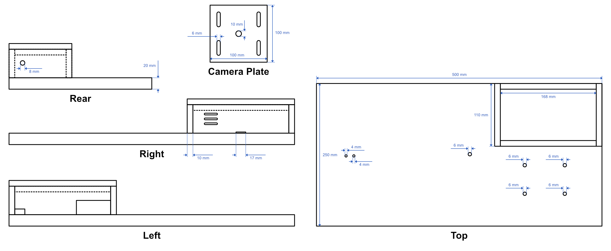

Inside the electronics housing, all PCBs are mounted using double sided tape. The same applies to a small cooling fan mounted in the inside of the three cooling slits. This fan is strictly necessary to provide cooling to the Pi and the power supply components. I have found in tests, that with the fan and the cooling radiators installed on the Pi, the SOCs temperatures under load remain significantly lower than they do with the Pi out in the open air but without a cooling fan or radiator. The inside of the electronics housing is shown below.


The projector is mounted using screws through holes. The screws are screwed through the base plate and into the holes that the projector's feet were originally screwed into. Note that this particular projector uses a special type of screw thread on the front that is 6mm in diameter and has two threads, each with twice the pitch of a standard M6 thread. I was unable to find buy a suitable screw for this, but the original foot is effectively a screw and worked just fine as such to mount the projector to the base plate. To mark the screw holes for the projector in the correct locations, a piece of paper was place on the bottom of the projector, the holes were traced and then transferred to the plywood. As the bottom of the projector is not at a perfect right angle relative to its sides and the film gate, washers were pushed under the higher side such that the projector stands mostly upright.

A camera mounting plate made from plywood is installed in the front left corner. It is further detailed in section TODO.


### Software design

The software for this project consists of two parts: the film scanning logic taking care of film advance and image capture, and the user interface logic serving a web interface to simplify and streamline the interaction with the scanner.


#### Scanning operations

The scanning operations, including advancing the film and capturing frames, are handled by the `FilmScanner` class. Scanning is done by capturing the current frame, submitting it to a concurrent save method and then triggering the frame advance before repeating the process. To advance to the next frame, the stepper motor is ramped up and then run at a constant speed until the hall effect sensor was detected, at which point it is ramped down again. There is both a minimum time that has to pass before a completed frame advance may be detected as well as a timeout. If a timeout is detected before the hall effect sensor, the scanner will attempt to recover by reversing the advance mechanism until the hall effect sensor it detected and then reattempting the frame advance. Before submitting a frame for concurrent saving, the scanner might wait, if the previous frame has not finished saving yet. This prevents unsaved frames from piling up if the memory is slow for some reason.

The `pigpio` package is used to interface with the Hall effect sensor, the LED light and the stepper motor. The `picamerax` package is used to interface with the HQ camera.

The scanning code provides callbacks for various events, such as beginning and end of a scan, make it easy to implement various functions, e.g. the GUI or e-mail notifications, without the need to modify the actual scanning code.

#### Dashboard and other user experience

In order to make setting up and monitoring scans easier, the scanner provides a GUI. The goal was to make the scanner fully independent from other devices, such that a scan can be set up and then run fully unattended without even the need for a PC to be connected. To this end, a web interface was chosen. The web interface can be opened on any PC or even smartphone or tablet with a browser that is on the same network as the scanner, and it can be closed as soon as the scan is setup without interfering with the scan. Furthermore, the web interface can be reloaded at any time to check on the scan, again without interfering with the latter. Screenshots of both the desktop and mobile version of the web interface are shown below.

Desktop web interface (dark mode)                                          |  Mobile web interface (dark mode)
:-------------------------------------------------------------------------:|:---------------------------------:
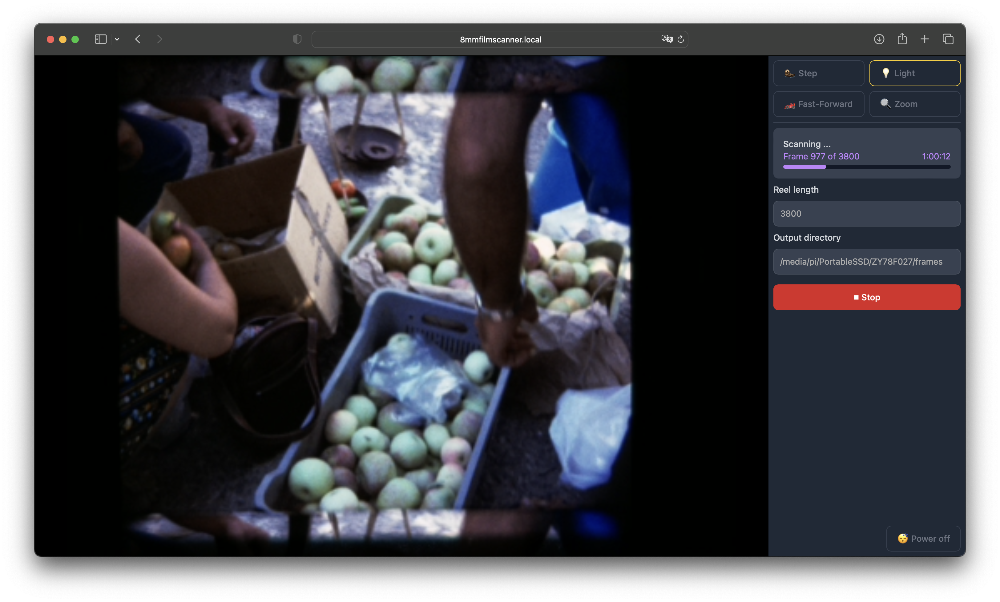  |  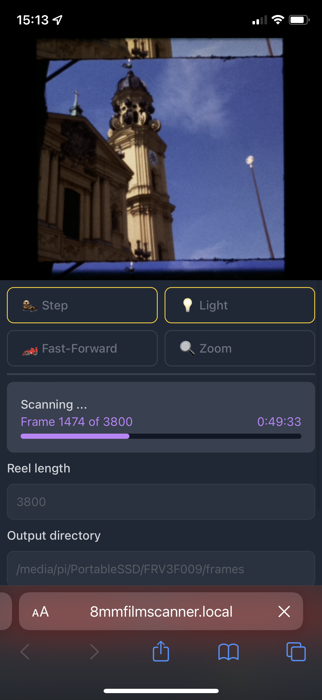

The web interface is implemented in `server.py` using the *Flask* package. A number of commands that can be sent to the scanner are implemented via different routes. The scanner also streams a live preview of the camera. During scanning, this preview is replaced with the most recently scanned frame.

The frontend of the web interface is implemented in Javascript as a REACT app in the `frontend` directory. TailwindCSS was used for styling.

Automated e-mail notifications are implemented using a callback to the callbacks provided by the `FilmScanner` class. These are currently set up to send an e-mail notification when a scan has finished or was aborted because of some error. Note that this requires the scanner to have either its own e-mail account or access to the user's e-mail account.


### Scanning workflow

In this section I would like to briefly go over my current scanning workflow to illustrate how the scanner may be used to produce archivable digital copies of 8mm film reels. Note that this is what my workflow looks like right now and likely to change and evolve over time. It also certainly is not the only way to do it and there probably are better ways to get the results you are looking for.

Before starting to scan any of my film, I actually started by creating a list of all the film I have, giving every film a unique ID so I can identify them later. This allows me to easily track the progress of my scanning project over a long period of time and see which reels I have already scanning or what stage of post-processing I last left them in. Based on the IDs, I maintain a spreadsheet with various information on each reel. This includes their current status, which can be any one of *not digitised*, *old digitisation*, *in progress*, *scanned* and *finalised*, where *old digitisation* refers to a reel digitised with an inferior method many years ago and *finalised* means that a reel has been into a larger film project (for example of all reels from a holiday). Further, the spreadsheet contains information on where to find the physical reel, the type of film, its length and what larger project the reel belongs to. In my particular case, many of the reels were actually labeled with detailed information on their contents. I have created a text document that with typed copies of these labels and the corresponding reel ID. A screenshot of the spreadsheet is shown below.

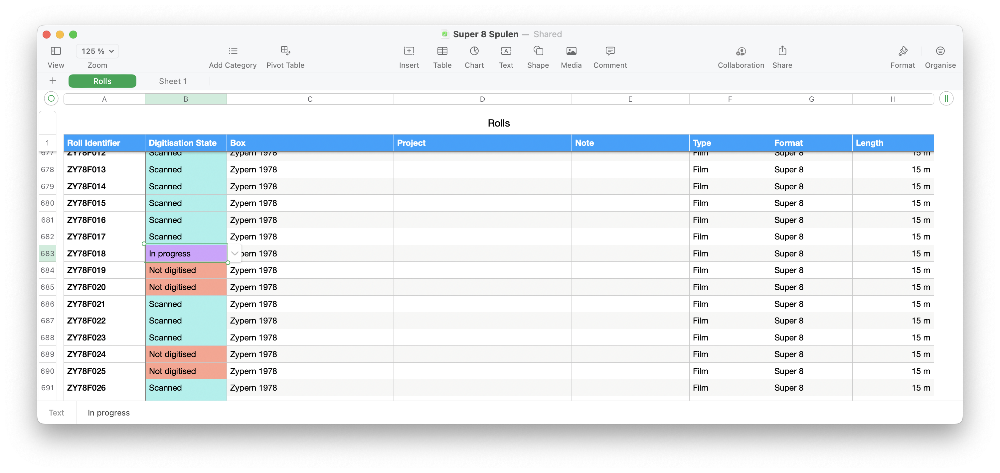

When it is time to scan a particular reel, I start by physically cleaning the film. To do this, I put the film on a film editing viewer. Then I put a few drops of TODO cleaning solution onto a lint-free cloth and spool the film onto another reel while grabbing the film with the soaked piece of cloth. It is advisable to swap the spot on the cloth every couple of meters and put on new cleaning solution as to avoid scratching the film with the dirt that came off it. Once the film is completely wound over, I wind it back onto its original reel. Note that I only attach the end of the film to the original reel very loosely so it comes off the reel easily when scanning. For your average Super 8 reel this is easiest done by not putting the film into the "claw" that is supposed to hold it, but to gently place it in the slit that usually allows you the see how full the reel is. Then just wind and the film will stay in place.

I then thread the film onto the scanner and fast-forward to the first frame that is fully visible. I use this frame to focus the camera onto the film grain. The *Zoom* view offered by the web interface is very useful for the final focus adjustment. You might need to focus back and forth a little bit, until **the grain** appears as sharp as it gets.

For the number of frames to scan, I usually estimate the number of frames on the reel based on its length and the pitch of the film type, and then add ca. 5% to be sure to capture the entire film in one go. For example, for a 15 m (50 feet) reel, I capture 3800 frames, while the reel usually actually has around 3600 frames.

Rather than saving the scan on the Pi's SD card, I connect an external SSD via USB. It turns out this is significantly faster than using the SD card, so much so that with the SD card, the scan may be slowed down waiting for frames to save, which does not happen at all when using an external SSD. Note that I think for its speed, it is important to choose an SSD over a hard drive here. The path I select is `/media/pi/*path-to-ssd*/*rheel-id*/frames`.

Once the scan (or multiple scans) is done, I shut down the scanner and connect the SSD to my computer. At this stage I usually like to delete the empty frames from the end of the reel to save memory and processing time in the next steps. The Pi captures images, but only attaches the raw bayer data to JPG files. Therefore, the next step is to use the `dngconverter.py` script to convert the images to `.dng` files. Note that this specifically requires version `3.4.7` of the `pidng` package. The script provides a `--delete` option to automatically delete the original JPG files once they have been converted, but I prefer to do this manually once I know the conversion was successful. The converted DNG files may appear green. This is not a problem!

The next step is to import all the images into *Adobe Lightroom*. Here, we correct the white balance and the exposure, and crop into the frames, making sure to include the whole frame, not just a 4:3 crop of it. Some film stocks have changed colour or faded over time. They might required a colour correction as well. Luckily, the very common Kodachrome film stock usually retains its colours excellently. Use Lightroom's *Copy Develop Settings* feature to make sure the settings are consistent for all frames on the reel (or at the very minimum the in the scene).

TODO Describe and provide Lightroom preset

While the provided exposure correction should be just fine for properly exposed scenes, you might encounter underexposed scenes in particular. Here it might make sense to pull up the *Exposure* slider, but values of more than 2.9 usually don't reveal any more image details. Note that this is not a limitation of the image files, but of the film itself, as experiments with longer exposure times have shown. Next, the frames are exported as TIFF files. I choose 8 bit TIFFs, as the frames are already (mostly) exposure- and colour-corrected. I also turn off compression as these are only temporary files and doing so significantly reduces export times. I like to export to an `lr_export` directory right next to the original `frames` directory.

Once the export has finished, I use *Apple Compressor* to render a video file from the exported images. Choose the little plus icon at the bottom of the Compressor window, click *Add Image Sequence*, select the `lr_export` directory with the exported frames in it and make sure to choose *Manually to* with the correct frame rate for your film gauge (16 fps for Regular 8 and 18 fps for Super 8). I export to *Apple ProRes 422* to retain quality in an intermediate format. In addition, I name my output file `*reel-id*_lr_export.mov` and save it in the same directory as the `frames` and `lr_export` directories.

At this point I check the exported video file, primarily because I'm excited to see the film for the first time, but also to check for issues that might warrant a second scan before I move on.

The next step is to fix defects and remove the gate weave from the footage in my video editing software. I use *Final Cut Pro*. 

**Note:** While Final Cut doesn’t officially support 18 fps projects, with a little workaround it will handle custom frame rates easily:

 1. Create a new empty project make sure it already has the correct resolution and colour space set. You will not be able to change it later.
 2. With the project selected, go to *File* → *Export XML…* and save the `.xml` file somewhere.
 3. Open the `.xml` file and find all the `frameDuration` fields. Change them to match your desired frame rate in the format that they are currently in. A screenshot below shows an example changed to 16 fps below. Don’t forget to save the file.
4. Now, go back into Final Cut. Select *File* → *Import* → *XML* and select the `.xml` file.

You should now have a project that correctly shows that it is 16 fps (or whatever you selected). If you want to avoid having to redo this process all the time, you can simply duplicate the project when you need a new one.

**A little trick here:** Duplicating with the keyboard shortcut *cmd+D* works even when the context menu item is greyed out. Only Apple knows why 🤔.

TODO Add screenshot of file

After importing the clip, I first crop it to the correct aspect ratio by selecting *Spatial Conform* -> *Type* -> *Fit* for the whole clip. Then I go through the clip from beginning to end and cut it at each scene change. Sometimes in analog film, frames between scene changes at overexposed or have light leaks. I like to remove these frames. I then stabilise each scene using the *SmoothCam* method. To make sure I'm only removing the gate weave but retaining original camera movement as much as possible, I turn the *Rotation Smooth* and *Scale Smooth* settings all the way to 0.0. The *Translation Smooth* setting is set to 0.33. Note that for any lower setting, Final Cut will not perform any stabilisation. In some scenes (for example when shot from a driving car) the natural shakiness of the footage overpowers the gate weave. In these cases, I will not stabilise the clip, because doing so would look over-processed and crop in too much into the original footage. Sometimes clips seems table, but Final Cut still chooses to crop in a lot. In these cases it might help to remove just a few frames from either end of the clip. This step of the process is also the right time to remove scenes with those from other scans of the same reel, if there were defects like black frames, doubled frames or large static pieces of dust in your scan.

Once all of this is done, I will export the clip to *Apple ProRes 422* to `*reel-id* fixed and stabilised` and reimport it to Final Cut. This is done to reduce processing times in the next step.

For the next step, I create a new project in Final Cut and add two copies of the reel stacked on top of each other. I leave the top clip untouched and apply the *NEAT Video* filter to the bottom one. In NEAT Video, I deactivate the *Spatial Filter*. The *Temporal Filter* is left activated and setup as shown below. These settings make sure to retain the grain but remove the dust. In an ideal world, I would just apply this filter to the entire clip. Unfortunately, this filter tends to produces quite unsightly artefacts from time to time. Therefore, I will go through the clip and deactivate sections of the unfiltered top clip only where there is a disturbing piece of dust, such that the bottom clip with the dust removed is visible for those frames. My goal here is not to remove all the dust, but only to remove the dust that distracts from the viewing experience. Ideally the film would look like a very clean film would have looked in its day, not entirely free of dust, but not visibly dirty either. I achieve this by watching the film once, and removing all the dust that is clearly obvious. I then watch it again, preferably in full screen, and check if any such dust remains.

TODO add screenshot of final cut

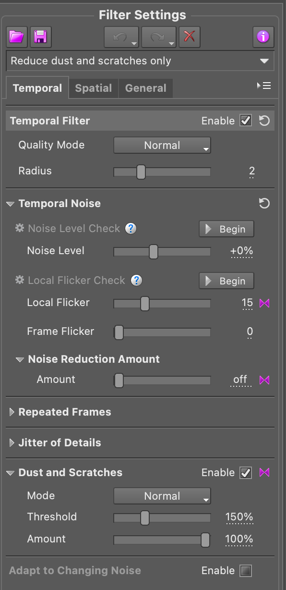

At last, I export the final clip as `*reel-id* final`. If the reel is part of a larger project, for example from a holiday, I will combine these final video files into a Final Cut project, once all reels have been scanned.


### Cost

TODO Put a table here of cost of everything


### Current issues, future features and fixes

While the scanner has successfully scanned well over 50 reels over the past year already, there for remain a number of things that are not quite perfect just yet. I hope to fix these some day, but well all know that nothing survives as long as a temporary solution.

 - **Dust removal workflow:** The dust removal as it is right now delivers excellent results, but it remains a lot of work. On a good day, I can currently finish the dust removal on one 15 m reel (just over 3 min) in 3-4 hours. At hundreds of reels to scan that is a very long time. Ideally, I would like a fully automatic solution. While NEAT Video is great, letting it fully do a reel without supervision does not give satisfying results. In the future, I would like to explore a neural network-based solution, similar to already existing solutions for video restoration, but less heavy-handed.
 - **Unreliable frame advance:** Most of the time the frame advance works just fine, but every 5k - 10k frames, it either produces a black frame, a doubled frame or a frame that is partially dark. This caused by the scanner not advancing fully, either because the Hall effect sensor was missed or because the belt connecting the stepper motor to the projector's mechanism slipped at the point where the mechanism has the most resistance. Unfortunately, because there is only this one sensor, the scanner cannot detect which of the two has happened (both have happened before, but now I suspect mostly the slipping). The problem is also difficult to debug due to it occurring so rarely, yet it happens often enough to be at least a little annoying. Possible solutions include:
    - Switching to a more reliable photo sensor. The Hall effect sensor seems to be not perfectly reliable due to its proximity to the stepper motor.
    - Adding a second sensor. This would allow the Pi to detect what has happened and recover it reliably if possible. To mount it, I would prefer to swap the base plate in the projector for a 3D-printed one that makes all components easier to mount.
    - Relubricating the projector's mechanisms. The projector's mechanisms may have more resistance than they should have. Adding new lubrication could fix this, but so far I have not dared to disassemble the mechanism to do this.
    - Ensuring proper belt tension on the drive belt. I have eyeballed the belt tension when installing the stepper motor, to be similar to the original motor. A slipping belt may be fixed by doing this properly. This is, however, outside of the scope of my personal expertise.
 - **Crashing live preview:** Sometimes the live preview goes black or freezes. This is caused by the preview thread crashing. It is easily fixed by rebooting the scanner and therefore has not been annoying enough for me to fix yet. It, too, is difficult to debug as it only happens sporadically.
 - **Lose PCB mounts:**  All components in the Raspberry Pi case on the base plate are mounted using double sided tape. This is too lose, especially for the Pi and the USB-C PD trigger board, because they move a lot when plugging things in our pulling them out. The trigger board has actually come lose since I've mounted it. I would like to 3D-print a mounting rack that screws into the wood and holds all the components in the case firmly.
 - **Web interface camera settings:** Adding camera settings to the web interface would be nice. I have not found the need for that yet, though, because all film stocks I have scanned so far worked with the same fixed exposure. This is actually to be expected with properly exposed films. Over- and underexposed films are easily fixed thanks to scanning in RAW format.


## Run the software on your own scanner

You are welcome to run this software or modified versions of it on your own scanner. A prerequisite is that the hardware is setup in roughly the same way (though it does not need to be based on a projector). You will need to make sure that the GPIO connections are either on the same pins as my scanner or that you change the code according to your connections.

These instructions may be incomplete. Furthermore, they have not been fully tested as I only have a single scanner. Please feel free to create an Issue for any questions you might have or problems you might find.

Start by cloning the repository (`Desktop`)

```sh
git clone https://github.com/jank324/8mm-film-scanner.git
```

and install the required Python packages.

```sh
sudo python3 -m pip install -r requirements.txt
```

Then install *npm*

`cd` to `frontend` directory.

```sh
cd frontend
```

and its required packages.

```sh
npm install
```

Continue to build the frontend via

```sh
npm run build
```

then `cd` back to the project root (`..`) where you can start the server by running

```sh
sudo python3 server.py
```

You probably want to run the server on boot of the Pi, so the scanner is ready to scan within seconds of you turning it on and without the need for you to start anything manually. To this end, this repository provides a *systemd* service `8mmfilmscanner.service` that runs the 8mm Film Scanner's server on boot. To set up the service, copy the `.service` file to `/etc/systemd/system` by running

```bash
sudo cp 8mmfilmscanner.service /etc/systemd/system/
```

and then enable it via

```bash
systemctl enable 8mmfilmscanner
```

In order to send email notifications on finished scans, create a mail account of your choice or use your personal account. Create a file `notification_config.yaml` in the project root directory and fill in the following with the details of your mail account and the mail address you want e-mails to be sent to.

```yaml
user: scanners@mail.com           # Address of the scanner's account
password: scanners-password-123   # Password of the scanner's account
to: your@mail.com                 # Address notifications are sent to (presumably your own)
```

Please remember to **NEVER** commit `notification_config.yaml` as it contains the password to the scanner's mail account which should remain secret. Under normal circumstances, this repository's `.gitignore` should already take care of this.


# Contributing

You are welcome to contribute to this project. If you find any issues, you may create a corresponding Issue here on GitHub. Even better, if you fixed something, you may create a Pull Request.


# Acknowledgements

First and foremost I would like to acknowledge Matthew Aepler and his [Kinograph forums](https://forums.kinograph.cc). The forums have been an invaluable resource for this project and are one of the best resources on motion picture film scanning out there. I would also like to acknowledge everyone who has contributed to the forums and thereby to this any many other projects. Furthermore, I would like to acknowledge [Scott Schiller and his scanner build](https://youtube.com/playlist?list=PLIACRGgedheWF4xr1zxiASZ1QqJUfloQ2), which have been a major inspiration for the direction of this scanner build project.
