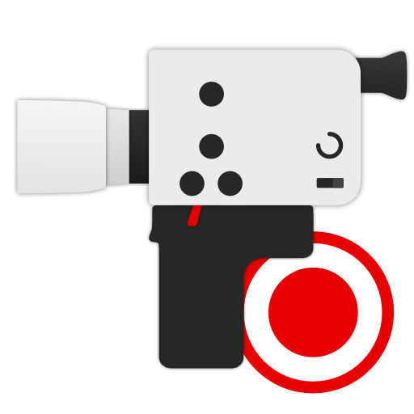

# 8mm Film Scanner

The *8mm Film Scanner* is a project to build a scanner for digitising motion picture film in both the *Regular 8* and *Super 8* gauges by converting an old projector with the help of a [Raspberry Pi](https://www.raspberrypi.org) single board computer.

In this repository, I have collected all my materials in this project, including information on the hardware and software design as well as my scanning workflow.



### Table of contents
- [Introduction](#introduction)
- [Detailed technical description](#detailed-technical-description)
    - [Hardware design](#hardware-design)
        - [Projector conversion](#projector-conversion)
        - [Camera](#camera)
        - [Electrical systems](#electrical-systems)
        - [Base plate and case](#base-plate-and-case)
    - [Software design](#software-design)
        - [Scanning operations](#scanning-operations)
        - [Dashboard and other user experience](#dashboard-and-other-user-experience)
    - [Scanning workflow](#scanning-workflow)
    - [Future features and fixes](#future-features-and-fixes)
- [Run the software on your own scanner](#run-the-software-on-your-own-scanner)
    - [Installation](#installation)
    - [How to use](#how-to-use)


## Introduction

motivation, what it can do, photo of the scanner, screenshot of the dashboard and sample scan


## Detailed technical description

Introduce every little technical detail on how the scanner is built and the software implemented


### Hardware design

Lorem ipsum

#### Projector conversion

#### Camera

#### Electrical systems

#### Base plate and case


### Software design

Lorem ipsum ... overview

#### Scanning operations

#### Dashboard and other user experience


### Scanning workflow

Lorem ipsum


### Future features and fixes

Dashboard camera settings, mounting PCBs in case


## Run the software on your own scanner

### Installation

Not tested because I have only one piece of hardware

Ensure same connections as those described above as well as Raspberry Pi with Raspberry Pi OS installed as normal

Clone repository (`Desktop`).

```sh
git clone https://github.com/jank324/8mm-film-scanner.git
```

Install python packages

```sh
sudo python3 -m pip install -r requirements.txt
```

Need *npm* installed.

`cd` to `frontend` directory.

```sh
cd frontend
```

install packages

```sh
npm install
```

then build frontend via

```sh
npm run build
```

`cd` back to the project root (`..`) then you can start the server by running

```sh
sudo python3 server.py
```

You probably want to run the server on boot of the Pi ...

This repository provides a *systemd* service `8mmfilmscanner.service` that runs the 8mm Film Scanner's server on boot. To set up the service, copy the `.service` file to `/etc/systemd/system` by running

```bash
sudo cp 8mmfilmscanner.service /etc/systemd/system/
```

and then enable it via

```bash
systemctl enable 8mmfilmscanner
```

then to send email notifications on finished scans

create mail account of your choice

create file `notification_config.yaml` in project root directory

Fill in the following with the details of your mail account and the mail address you want e-mails to be sent to

```yaml
user: scanners@mail.com         # Address of the scanner's account
password: scannerspassword123   # Password of the scanner's account
to: your@mail.com               # Address notifications are sent to (presumably your own)
```

Please remember to **NEVER** commit `notification_config.yaml` as it contains the password to the scanner's mail account which should remain secret. Under normal circumstances, this repository's `.gitignore` should already take care of this.

### How to use

Type in path, click here to start scan or turn on light etc. ...
